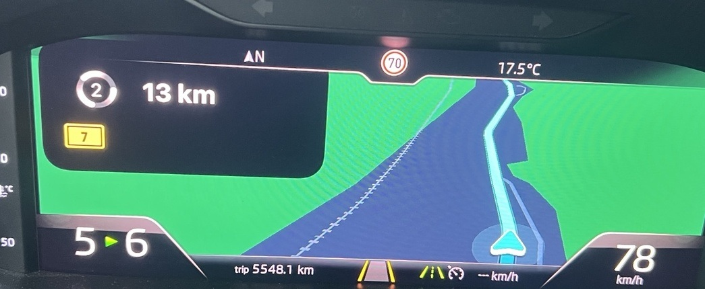
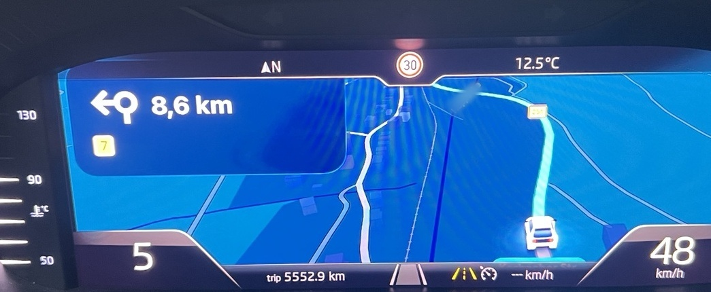
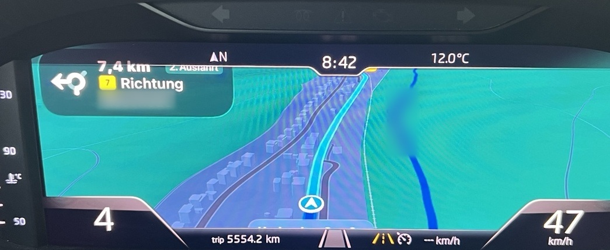

# Škoda MU1440 CarPlay navigation PoC — vehicle proof

Date: **2026-09-29**

## Result

An end-to-end vehicle proof of concept is now confirmed on the project's reference **Škoda MHI2 /
MU1440** system with the AID10-class Virtual Cockpit.

The current development path can render **live, moving CarPlay auxiliary navigation video** in the
Virtual Cockpit for all three tested providers:

- Apple Maps
- Google Maps
- Waze

The proven media route is:

```text
CarPlay navigation provider
        |
        v
Auxiliary / ScreenAlt
        |
        v
Stream type 111
        |
        v
H.264
        |
        v
direct MPEG-TS remux
        |
        v
/dev/mlb/isoTX2
        |
        v
MOST150
        |
        v
Škoda Virtual Cockpit
```

This is stronger evidence than the earlier synthetic/test-pattern work: the three navigation providers
produce visibly different native cluster layouts while using the same downstream VC transport path.

## Public vehicle evidence

### Waze



[Waze vehicle video (MP4)](../media/mu1440-stream111-poc-2026-09-29/waze_vc_stream111_video_public_minblur.mp4)

### Google Maps



[Google Maps vehicle video (MP4)](../media/mu1440-stream111-poc-2026-09-29/google_maps_vc_stream111_video_public_minblur.mp4)

### Apple Maps



[Apple Maps vehicle video (MP4)](../media/mu1440-stream111-poc-2026-09-29/apple_maps_vc_stream111_video_public_minblur.mp4)

## What the comparison shows

The downstream Virtual-Cockpit chrome remains consistent while the CarPlay-provided navigation area
changes substantially between providers. The tested renderers differ in maneuver-card geometry,
marker style, map detail, zoom/perspective and the amount of map area they use.

In this test set Apple Maps used relatively compact UI elements and exposed more map detail. That is
an observation about this vehicle/test state, not a compatibility or quality ranking.

## What is not finished

The PoC closes the question of whether real CarPlay navigation can reach the MU1440 Virtual Cockpit
through the current direct path. It does not close the remaining productization work.

Current follow-up items are:

- define and validate **SafeArea/ViewArea** geometry so CarPlay content is not hidden by VC overlays;
- support runtime switching between a **full-map** layout and the much narrower **reduced/tacho** view;
- determine which geometry/composition changes apply live and which need a UI refresh, keyframe or
  stream reacquire;
- continue lifecycle/provider-switch hardening;
- investigate the observed visual judder by capturing the incoming/router-side Stream-111 path in
  parallel with VC output and comparing frame-arrival timing.

## Public-media processing

The files in this directory are publication derivatives, not diagnostic masters.

Processing was deliberately limited to privacy/packaging work:

- rectangular crop around the Virtual Cockpit;
- source metadata removed;
- audio removed from videos;
- minimal blur over readable locality/street names where required;
- no generative editing, inpainting or synthetic replacement of image content.

The MP4 files were re-encoded for a small public-repository footprint. **Do not use these derivatives
for source frame-rate, frame-pacing or codec-timing analysis.** Use the original diagnostic captures
for that work.

## SHA-256 of published media

```text
cd101701c5595b56961390cd18e9462b167e4d8b61a92e5fb5381d202f5a66b8  waze_vc_stream111_photo_public_minblur.jpg
42305745085cb623a836982cbf28b2217011882cee0e8450d62bb3eb27aa5396  waze_vc_stream111_video_public_minblur.mp4
19296235b45fde94aa3fe26b8bce98fc41fb77c533491e98f9cac379ecc4021e  google_maps_vc_stream111_photo_public_minblur.jpg
8ca7718af5c5dd5cc15398ad64a41416c21aa805603a88fd6777db6c40a32a79  google_maps_vc_stream111_video_public_minblur.mp4
050e4a6984dea981343892736b9d7aa9c6fc7194a055535d1eb34a7e331e9c2f  apple_maps_vc_stream111_photo_public_minblur.jpg
770e28284bde8afaf055562e8fe4c804d11427d563b6473b0b644d8f38894a32  apple_maps_vc_stream111_video_public_minblur.mp4
```

## Scope statement

This milestone establishes a **Škoda MU1440 vehicle PoC**. It must not be read as proof that every
MHI2 train, every Škoda/VW/SEAT/CUPRA cluster revision, or every CarPlay lifecycle transition is
already supported.
