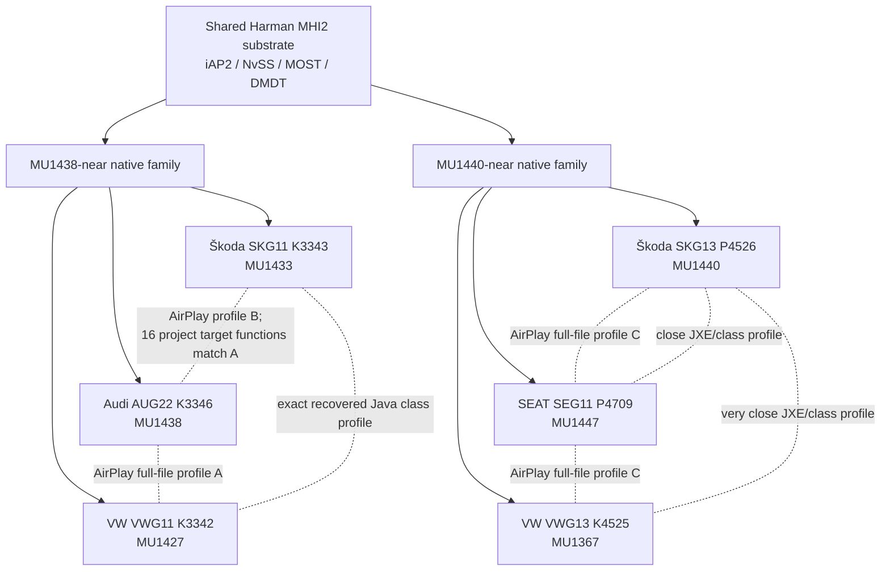

# MHI2 cross-firmware profile map

Date: **2026-09-28**

Status: **static cross-firmware research; not a vehicle-support matrix**

This document maps the implementation relationships found by the first completed MHI2 firmware
corpus pass. Its main result is simple:

> **firmware train names do not map one-to-one to implementation profiles.**

Large parts of the Harman MHI2 stack are reused across brands and trains. Other layers form a small
number of recurring profiles, while display ownership, geometry and selected Java/HMI paths remain
target-specific.

The current vehicle-proven runtime target remains:

```text
MHI2_ER_SKG13_P4526_MU1440
Škoda / AID10-class reference cluster
```

Static profile similarity does not extend that vehicle-support claim.

---

## Corpus baselines

The completed pass covers these exact European MHI2 baselines:

| Short name | Exact train | Corpus role |
| --- | --- | --- |
| Audi MU1438 | `MHI2_ER_AUG22_K3346_MU1438` | canonical AUG22/MU1438 comparator |
| SKG11 MU1433 | `MHI2_ER_SKG11_K3343_MU1433` | Škoda G11 |
| VWG11 MU1427 | `MHI2_ER_VWG11_K3342_MU1427` | Volkswagen G11 |
| SEG11 MU1447 | `MHI2_ER_SEG11_P4709_MU1447` | SEAT MHI2 line |
| Škoda MU1440 | `MHI2_ER_SKG13_P4526_MU1440` | vehicle-proven reference |
| VWG13 MU1367 | `MHI2_ER_VWG13_K4525_MU1367` | Volkswagen G13 |

For AUG22/MU1438 this project uses **K3346 as the canonical corpus input**. It is the customer-update
package already extracted and analyzed. A same-number P-labelled factory/production package is not
required as a separate corpus gate.

---

## High-level profile map



This is a **layer map**, not a flash/update compatibility map.

---

## 1. AirPlay / ScreenAlt receiver profiles

Across the six baselines, the complete `libairplay.so` files collapse to only **three** full-file
profiles:

| AirPlay profile | Members | Relationship |
| --- | --- | --- |
| A | Audi MU1438 + VWG11 MU1427 | byte-identical complete `libairplay.so` |
| B | SKG11 MU1433 | different complete library |
| C | Škoda MU1440 + SEG11 MU1447 + VWG13 MU1367 | byte-identical complete `libairplay.so` |

The SKG11 library is a distinct full-file profile, but the fixed 16 AirPlay/AltScreen target
functions used by this project are byte-identical to the Audi MU1438 target functions.

Therefore:

```text
different full library SHA
    !=
different hook surface
```

The opposite also matters: a matching hook surface does not establish whole-library ABI or runtime
compatibility.

---

## 2. Profile-forming native services

The focused Ghidra closure covered these profile-forming components:

- `dio_manager`
- `smartphone_integrator`
- `displaymanager`

All four additional Wave-1 firmware builds are distinct complete binaries, but their function-level
relationships divide clearly:

| Firmware group | `dio_manager` | `smartphone_integrator` | `displaymanager` |
| --- | --- | --- | --- |
| SKG11 MU1433 + VWG11 MU1427 | MU1438-nearest | MU1438-nearest | MU1438-nearest |
| SEG11 MU1447 + VWG13 MU1367 | MU1440-nearest | MU1440-nearest | MU1440-nearest |

“Nearest” is based on same-named function-body hashes and mnemonic-shape relationships. It is a
profile-navigation result, not a support verdict.

### DisplayManager example

For `displaymanager`:

```text
SKG11 / VWG11:
  43 named functions common with each reference
  43 exact bodies match MU1438
  20 exact bodies match MU1440

SEG11 / VWG13:
  inverse relationship
  20 exact bodies match MU1438
  43 exact bodies match MU1440
```

That is a strong implementation-family signal despite different complete file hashes.

---

## 3. Stable native islands

Several lower-level components are substantially more stable than their containing firmware
packages.

Observed examples:

| Component | Current corpus finding |
| --- | --- |
| `libiap2client.so.1` | identical executable-code islands across compared trains |
| `libnvss_video.so` | identical executable-code islands |
| `mm-ipod` | identical executable-code islands |
| `dmdt` | identical code in the Audi/Škoda reference comparison; version-string delta |
| `libdmdt_core.so` | identical code in the Audi/Škoda reference comparison; build/path metadata delta |
| `devp-iso-mmx-mib2` | Audi/Škoda comparison found no code/data delta; only ELF program-header physical-address bytes differed |

This is why the research corpus is content-addressed: identical code is analyzed once and referenced
from every firmware that contains it.

---

## 4. Java / IBM J9 profile map

The outer `lsd.jxe` files are distinct, but class-level comparison shows extensive reuse.

### SKG11 and VWG11: exact recovered Java profile

The two JXE containers have different hashes, but conversion produces:

```text
25,892 class paths
25,892 identical class byte sequences
```

For the recovered class content:

> **SKG11 MU1433 and VWG11 MU1427 are one exact Java profile.**

### Škoda MU1440, SEG11 and VWG13

Against the MU1440 reference:

| Pair | Common class paths | Byte-identical common classes | Common-path deltas |
| --- | ---: | ---: | ---: |
| MU1440 ↔ SEG11 MU1447 | 26,193 | 25,659 | 534 |
| MU1440 ↔ VWG13 MU1367 | 26,291 | 26,194 | 97 |

VWG13 has the same compared class-path set as MU1440; only 97 common paths have different bytes.

### MOST/Kombi Java island

Within:

```text
de/vw/mib/asl/internal/mostkombi/
```

the five Škoda/VW/SEAT baselines all expose the same 98 class paths, and:

```text
97 / 98 classes
```

are byte-identical across all five.

This is one of the strongest current signals that the low-level MQB Kombi substrate is shared much
more broadly than firmware train names imply.

The navigation-map/Kombi ownership layer is less uniform and remains a target-specific review area.

---

## 5. Production configuration profiles

Configuration data also collapses to a small number of normalized profiles.

### `displaymanager.json`

Only **three** normalized profiles:

| Profile | Members |
| --- | --- |
| D1 | Audi MU1438 |
| D2 | SKG11 + VWG11 + SEG11 |
| D3 | Škoda MU1440 + VWG13 |

### `smartphone_integrator.json`

Four normalized profiles:

- Audi MU1438
- SKG11
- VWG11
- one exact shared profile: Škoda MU1440 + SEG11 + VWG13

### `dio_manager.json`

Five normalized profiles:

- Audi MU1438
- Škoda MU1440
- shared SKG11 + VWG11
- SEG11
- VWG13

### `videoovermost.json`

Only **two** normalized profiles:

- Audi MU1438
- one shared profile used by all five Škoda/VW/SEAT baselines

---

## 6. Display / MOST routing map

All six production `displaymanager` configurations share the same broad topology markers:

```text
main terminal      Tegra:TFTLCD0
second output      Tegra:HDMI0
second display ID  4
MOST encoder       present
MOST TX target     /dev/mlb/isoTX2
```

The configured geometry and policy split into three groups:

| Config group | Queue / bytes per frame | Forced route | RVC geometry | Topview |
| --- | --- | --- | --- | --- |
| Audi MU1438 | 8 / 20,000 | `component_control` | 720×384 at (0,56) | 1024×480 |
| SKG11 / VWG11 / SEG11 | 18 / 40,960 | none | 800×428 at (0,0) | 800×480 |
| Škoda MU1440 / VWG13 | 18 / 40,960 | none | 1067×571 at (107,0) | 1280×640 |

Audi enables annotation in this configuration; the other five baselines do not.

These values describe extracted production configuration. They do not prove which route is
productive on every vehicle/cluster combination.

---

## 7. Startup / LSD grouping

Startup evidence reinforces the same layered model.

### `lsd.sh`

Observed exact profiles:

| Profile | Members |
| --- | --- |
| L1 | Audi MU1438 |
| L2 | Škoda MU1440 |
| L3 | SKG11 + VWG11, exact shared bytes |
| L4 | VWG13 |

The selected SEG11 app tree did not contain this path; that is an extraction observation, not a claim
that SEG11 has no Java/HMI runtime.

### Framework / DSI startup

`framework.json` and `dsistartup.json` each collapse to two exact groups:

```text
Audi MU1438 + SKG11 + VWG11

Škoda MU1440 + SEG11 + VWG13
```

This aligns unusually well with the native function-profile split.

---

## 8. What the corpus currently says

The strongest current conclusion is not:

> “all of these firmwares are compatible.”

It is:

> **the MHI2 software stack is assembled from reusable layers whose profile boundaries do not match
> firmware train names one-to-one.**

Current rough layering:

```text
very stable / broadly shared
    iAP2
    NvSS
    mm-ipod
    MOST driver
    large mostkombi Java island
             │
             ▼
small number of repeated profiles
    libairplay
    framework / DSI startup
    production JSON configuration
             │
             ▼
more target-specific
    dio_manager
    smartphone_integrator
    displaymanager
    navigation/Kombi ownership
    display geometry / cluster presentation
```

That supports a future target model based on a combination of:

```text
AirPlay profile
+ native ownership profile
+ Java/HMI profile
+ routing/config profile
+ cluster hardware/profile
```

rather than one hand-built port per firmware filename.

---

## 9. Research-run status

### Completed: Wave 1 cross-firmware corpus

**CLOSED / VERIFIED**

The completed run covers:

```text
AUG22 K3346 MU1438
SKG13 P4526 MU1440
SKG11 K3343 MU1433
VWG11 K3342 MU1427
SEG11 P4709 MU1447
VWG13 K4525 MU1367
```

Closure included:

- **74,574 / 74,574** independently rehashed materialized files;
- zero mismatches, missing files or unexpected files in that gate;
- **12** targeted Ghidra profile-forming inputs;
- **0** Ghidra export failures;
- **45** curated research-evidence files;
- **45 / 45** local-evidence ↔ Git-blob hash matches;
- focused regressions **6 / 6 PASS**;
- generic firmware-toolkit suite **58 PASS** with one expected Windows symlink skip;
- routing, config, startup and JXE/class matrices.

### Current: AU37X same-family / same-MU comparison

**IN PROGRESS / NEXT AUTHORIZED CORPUS RUN**

Targets:

```text
MHI2_ER_AU37X_P5089_MU1326
MHI2_ER_AU37X_P5153_MU1326
```

Purpose:

- determine whether two AU37X releases with the same MU collapse to one implementation profile;
- compare them globally against the completed six-baseline corpus;
- determine whether AU37X joins an existing AirPlay/native/Java/routing family or introduces a new
  profile;
- decompile only genuinely new content.

After that checkpoint, the remaining Audi families can be prioritized by **new profile value** rather
than by blindly processing every firmware package.

### AUG22 canonical target

The completed AUG22 comparator remains:

```text
MHI2_ER_AUG22_K3346_MU1438
```

K3346 is the canonical customer-update corpus target for this family/MU and is already fully
represented in the completed run.

---

## 10. What this does not prove

None of the static findings above prove:

- that the same binary can safely be loaded on another train;
- that a given cluster uses the same productive video route;
- that a matching AirPlay hook profile means identical object layouts;
- that matching Java classes mean identical display ownership;
- that a Škoda runtime package is safe on VW, SEAT or Audi;
- that a firmware family is vehicle-supported by this project.

Vehicle admission remains a separate gate requiring at minimum:

```text
firmware/component identity
+ cluster hardware/revision
+ productive display/MOST/LVDS route
+ geometry/ViewArea behavior
+ reversible real-vehicle validation
```

See the [compatibility matrix](../testing/COMPATIBILITY_MATRIX.md) for actual project support status.
